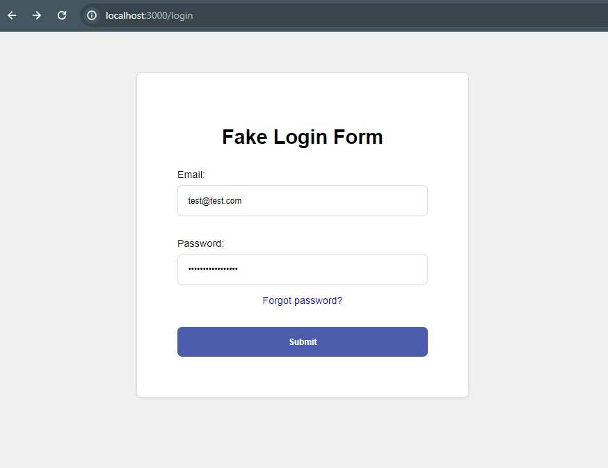

## spoof-login-page

This is a Node.js application providing a fake login form for users to enter their email and password. Once submitted, this data is stored into a text file and the user is redirected to a 'Success' page containing a message. 

* Node.js
* Express.js

